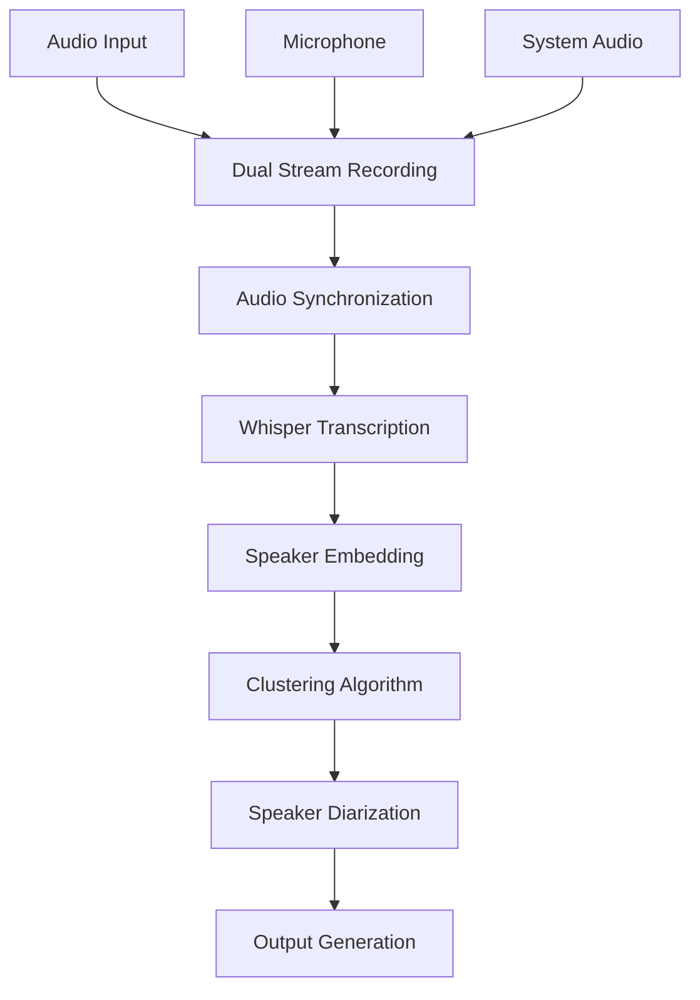

# 🎙️ Offline Meeting Transcriber

> **Privacy-first, AI-powered meeting transcription with speaker diarization - completely offline**

[](https://python.org)
[](LICENSE)
[](#privacy-first)
[](#cross-platform)

Transform your meetings into searchable, speaker-labeled transcripts without sending any data to the cloud. This tool combines advanced speech recognition with speaker diarization to create professional meeting records.

## ✨ Features

- 🎯 **100% Offline** - No internet required, complete privacy
- 🎙️ **Dual Audio Capture** - Records both microphone and system audio
- 🗣️ **Speaker Diarization** - Automatically identifies different speakers
- 🌍 **Multi-language Support** - Configurable language detection
- 💻 **Cross-platform** - Works on Windows and Linux
- ⚡ **Fast Processing** - Optimized for CPU inference
- 📝 **Multiple Output Formats** - Plain text and speaker-labeled transcripts
- 🔧 **Easy Setup** - Simple CLI interface

## 🚀 Quick Start

### Prerequisites

- Python 3.8 or higher
- Git LFS (for downloading models)
- Audio input device (microphone)
- ~2GB free disk space for models

### Installation

#### 🚀 **Quick Install (Recommended)**

**Linux/Mac:**
```bash
git clone https://github.com/yourusername/offline-meeting-transcriber.git
cd offline-meeting-transcriber
chmod +x install.sh
./install.sh
```

**Windows:**
```cmd
git clone https://github.com/yourusername/offline-meeting-transcriber.git
cd offline-meeting-transcriber
install.bat
```

The installation script will automatically:
- ✅ Create a virtual environment
- ✅ Install all Python dependencies
- ✅ Download Whisper model (~1.5GB) via git lfs
- ✅ Download SpeechBrain speaker model (~100MB) via git lfs
- ✅ Set up the complete environment
- ✅ Test the installation

#### 🔧 **Manual Installation**

If you prefer to install manually:

1. **Clone the repository**
   ```bash
   git clone https://github.com/yourusername/offline-meeting-transcriber.git
   cd offline-meeting-transcriber
   ```

2. **Create virtual environment**
   ```bash
   python -m venv venv
   
   # Windows
   venv\Scripts\activate
   
   # Linux/Mac
   source venv/bin/activate
   ```

3. **Install dependencies**
   ```bash
   pip install -r requirements.txt
   ```

4. **Download models** (first run will download automatically)
   - Whisper model (~1.5GB)
   - SpeechBrain speaker model (~100MB)

#### 📋 **Installation Scripts**

The repository includes automated installation scripts:

- **`install.sh`** - Linux/Mac installation script
- **`install.bat`** - Windows installation script

These scripts handle the complete setup process and are the recommended way to install the dependencies.

### Usage

#### Start Recording
```bash
# Record with microphone + system audio
python cli.py start

# Record system audio only (no microphone)
python cli.py start --no-mic
```

#### Stop Recording & Process
Press `Ctrl+C` to stop recording and automatically process the audio.

#### Windows Users
Double-click `meeting-agent.bat` for easy startup.

**Note:** The recording will automatically stop and process when you press `Ctrl+C`.

## 📁 Output Files

After processing, you'll find these files in `output/YYYYMMDD/`:

- `recording_HHMMSS.wav` - Original audio recording
- `transcription_HHMMSS.txt` - Plain text transcription
- `diarized_HHMMSS.txt` - Speaker-labeled transcription

### Example Output

**Plain Transcription:**
```
When you become fascist or communist or anarchist in those years, you can also simply be someone who never reasons...
```

**Diarized Transcription:**
```
SPEAKER_01 (00:00-01:10): When you become fascist or communist or anarchist in those years, you can also simply be someone who never reasons and therefore it's true yes I go with my friends and beat up those others...

SPEAKER_00 (01:10-02:14): We're not doing that well, no we're not doing that well guys, if it goes well you make me laugh...
```

## 🏗️ Architecture



### Core Components

- **Audio Recorder** (`src/recorder.py`) - Cross-platform dual-stream audio capture
- **Whisper Engine** (`src/transcriber.py`) - Offline speech-to-text transcription
- **Speaker Diarizer** (`src/speaker_diarizer.py`) - AI-powered speaker identification
- **CLI Interface** (`cli.py`) - User-friendly command-line tool

## 🔧 Configuration

Edit `config.py` to customize:

```python
# Audio settings
SAMPLE_RATE = 16000
CHUNK_SIZE = 1024

# Whisper settings
WHISPER_MODEL = "medium"  # base, small, medium, large
WHISPER_LANGUAGE = "en"   # Language code

# Model paths
WHISPER_MODEL_PATH = "./models/faster-whisper-medium/"
DIARIZATION_MODEL_PATH = "./models/spkrec-ecapa-voxceleb/"
```

## 🎯 Use Cases

- **Business Meetings** - Professional meeting documentation
- **Interviews** - Speaker identification for interviews
- **Lectures** - Educational content transcription
- **Podcasts** - Multi-speaker content analysis
- **Accessibility** - Automated transcription with speaker labels
- **Research** - Academic meeting analysis

## 🛠️ Technical Details

### Audio Processing
- **Sample Rate**: 16kHz (optimized for speech)
- **Format**: 16-bit WAV
- **Channels**: Mono (stereo converted to mono)
- **Mixing**: 50/50 blend of microphone and system audio

### AI Models
- **Transcription**: OpenAI Whisper (faster-whisper implementation)
- **Speaker Diarization**: SpeechBrain ECAPA-TDNN embeddings
- **Clustering**: Agglomerative clustering with silhouette scoring

### Performance
- **CPU Only**: No GPU required
- **Memory**: ~2GB RAM usage
- **Speed**: Real-time recording, ~2x processing time
- **Accuracy**: High accuracy for clear speech

## 🔒 Privacy & Security

- ✅ **100% Offline** - No data leaves your device
- ✅ **No Cloud Dependencies** - All processing local
- ✅ **No Internet Required** - Works in air-gapped environments
- ✅ **Open Source** - Transparent code, auditable
- ✅ **Local Models** - No external API calls

## 🐛 Troubleshooting

### Common Issues

**No audio devices found:**
```bash
# Linux - Check PulseAudio
pulseaudio --check

# Windows - Check audio drivers
# Ensure WASAPI is enabled
```

**Model download fails:**
```bash
# Manual model download
python -c "from faster_whisper import WhisperModel; WhisperModel('medium')"
```

**Poor transcription quality:**
- Ensure clear audio input
- Check microphone levels
- Try different Whisper model sizes
- Verify language setting matches audio

**Recording doesn't stop:**
- Press `Ctrl+C` to stop recording and process audio
- The system will automatically transcribe and diarize after stopping

**Installation issues:**
- Make sure you have Python 3.8+ installed
- Ensure you have Git LFS installed (required for model downloads)
- Ensure you have internet connection for model downloads
- If models fail to download, try running the installation script again
- Check that you have sufficient disk space (~2GB for models)
- On Windows, make sure you're running the batch file as administrator if needed

### Platform-Specific Notes

**Windows:**
- Requires `pyaudiowpatch` for system audio capture
- WASAPI loopback support needed
- May need audio driver updates

**Linux:**
- Requires PulseAudio or PipeWire
- May need additional audio packages
- Check device permissions

## 🤝 Contributing

We welcome contributions! Please see our [Contributing Guidelines](CONTRIBUTING.md) for details.

### Development Setup

1. Fork the repository
2. Create a feature branch
3. Make your changes
4. Add tests if applicable
5. Submit a pull request

### Areas for Contribution

- Additional language support
- GUI interface
- Mobile app
- Cloud integration (optional)
- Performance optimizations
- Documentation improvements

## 📄 License

This project is licensed under the MIT License - see the [LICENSE](LICENSE) file for details.

## 🙏 Acknowledgments

- [OpenAI Whisper](https://github.com/openai/whisper) - Speech recognition
- [SpeechBrain](https://speechbrain.github.io/) - Speaker diarization
- [faster-whisper](https://github.com/guillaumekln/faster-whisper) - Optimized Whisper implementation
- [PyAudio](https://people.csail.mit.edu/hubert/pyaudio/) - Audio I/O

## 📊 Stats


---

**⭐ Star this repository if you find it useful!**

**🐛 Found a bug?** [Open an issue](https://github.com/yourusername/offline-meeting-transcriber/issues)

**💡 Have a feature request?** [Start a discussion](https://github.com/yourusername/offline-meeting-transcriber/discussions)

**📧 Questions?** [Contact us](mailto:your-email@example.com)
